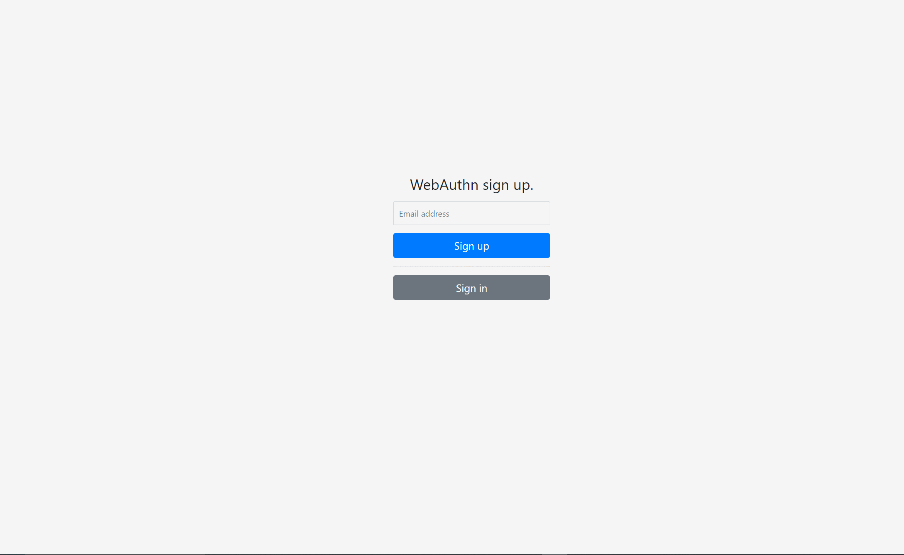

# 動作環境
- Docker, Docker Composeがセットアップされていること
- セキュアコンテキスト（https, localhost）であること

# 概要説明
- webauthn-angular-sample；クライアントサンプル
- webauthn-nestjs-sample；認証サーバサンプル

# 動作手順
資材一式のクローン
```
$ git clone https://gitlab.com/s.kawamura/fido2-man-stuck-sample.git
```

起動
```
$ cd fido2-man-stuck-sample
$ docker-compose up -d --build
```

# 動作イメージ
## ユーザ登録


## ユーザ認証

